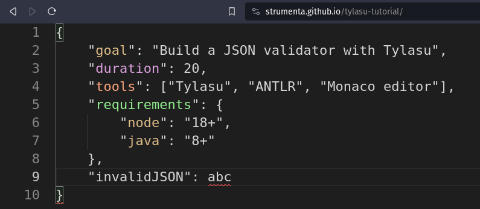
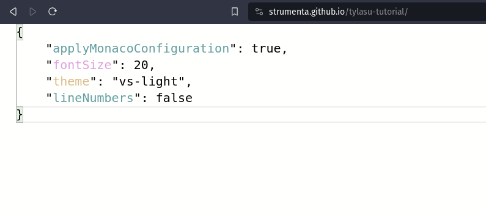
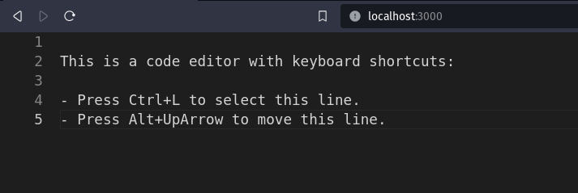
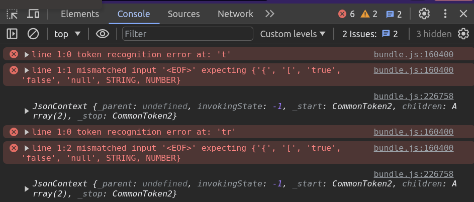

# Build a rich JSON validator website with Tylasu

## Introduction

As developers, most of us are familiar with JSON.
It has become the go-to format to represent data.
Chances are that at some point, you have wanted to validate JSON data or ensure it contains all the information you expect.

Some existing websites like [jsonlint] or [jsonformatter] offer you that.
But have you ever wondered how you could build such a website? 
Of course, there are a million ways to do it. But choosing the right tools can make the task easy, even fun.

Here at Strumenta, we build all kinds of tools related to languages, and data validators are no exception. In this tutorial, we will show you how to leverage the power of [Tylasu], [ANTLR], and [Monaco], all open-source tools, to build a friendly JSON validator website. Here is what it looks like:



You can play with it online at https://strumenta.github.io/tylasu-tutorial

It is a website that looks and acts like an editor. In fact, it’s based on the Monaco editor by Microsoft. Whenever you type on it, it parses the code expecting some JSON. It displays error markers over incorrect code, and colors each member depending on the type of its value.

It even has a secret feature:
If an `"applyMonacoConfiguration": true` member is present, the code will be interpreted as Monaco configuration and applied to the editor on the spot.
Try changing the font size or the editor's theme like this:



The complete codebase is on [Github], with a dedicated git tag for each of the 7 tutorial steps. We can use them to check our progress or skip over steps completely.
Everything ready? Let's start:

## 1. Creating the editor

I am a huge believer in having something visual and interactive to play with as soon as possible.
So let's start with the editor.
It's a regular HTML, CSS and JS static website:

```html (index.html)
<head>
    <link rel="stylesheet" href="index.css">
    <link rel="stylesheet" href="bundle.css">
    <script src="bundle.js" defer></script>
</head>

<body>
    <section id="editor"></section>
</body>
```
```css (index.css)
body {
    margin: 0;
}

#editor {
    height: 100vh;
}
```
```typescript (index.ts)
import * as monaco from "monaco-editor";

monaco.editor.create(document.getElementById("editor")!, { theme: "vs-dark", fontSize: 22 });
```

The page has a single element, `editor`, that is styled to take up the whole viewport.
The code creates a Monaco editor inside this element with a dark theme and a bigger font size. We will give the user the ability to customize the editor later in the tutorial.

Of course, we need to bundle the TypeScript code with its dependencies into the `bundle.js` and `bundle.css` that the HTML file is expecting.

First, let's install the `monaco-editor` node package as dependency:

```shell
$ npm install monaco-editor
```

Then, we'll create the bundle executing the `esbuild` node package with `npx`:

```shell
$ npx esbuild index.ts --bundle --outfile=bundle.js --loader:.ttf=empty
```

And the webiste is ready!
We can serve it locally using the `serve` package:

```shell
$ npx serve . -p 3000
```

Now we can open a browser at http://localhost:3000 and enjoy typing some code.
Developers who are familiar with VS Code can use the same keyboard shortcuts here. In fact, Microsoft created Monaco to serve as the editor in VS Code.



## 2. Structure of the project

Now that we have tasted the cake, let's take a moment to organize our files.
We'll follow a standard project structure, that happens to be the same that Maven projects use in Java.
Let's move the HTML and CSS to `src/main/resources`, let's put `index.ts` under `src/main/typescript` and leave the `package.json` in the root folder with some useful modifications:

```json (package.json)
{
  "dependencies": {
    "monaco-editor": "^0.44.0"
  },
  "devDependencies": {
    "esbuild": "^0.19.8",
    "serve": "^14.2.1"
  },
  "scripts": {
    "all": "npm install && npm run createDistribution && npm run bundle && npm run serve",
    "createDistribution": "mkdir -p dist && cp src/main/resources/* dist",
    "bundle": "esbuild src/main/typescript/index.ts --bundle --outfile=dist/bundle.js --loader:.ttf=empty",
    "serve": "serve dist -p 3000"
  }
}
```

We don't need access to `esbuild` and `serve` at runtime, so we can mark them as `devDependencies`.
Defining scripts inside `package.json` allows us to run tasks using `npm run <task-name>`.
In particular, the `npm run all` task will build the entire project from scratch by:
* Installing all the dependencies
* Creating a `dist` folder and moving the HTML and CSS to it
* Bundling the code and its dependencies into `dist/bundle.js` and `dist/bundle.css`
* Serving the `dist` folder at http://localhost:3000

Now, everytime we make a change, we can run

```shell
$ npm run all
```

to serve the website with the latest changes applied.

## 3. Parsing the Code in the Editor

Let's provide some feedback depending on the code the user types in the editor.

We will use ANTLR, an industry-standard tool for language recognition. ANTLR is very powerful and can understand everything from small DSL programs to full C++ projects. To keep the example familiar to most developers, we will use it to parse JSON, but feel free to experiment with other languages.

ANTLR takes takes formal language grammars as input and produces the source code of a parser as output.
Thankfully, the official ANTLR repository includes many grammars of popular languages ready to be used, including one for JSON.
Let's say thanks and copy the [json grammar] into `src/main/antlr/JSON.g4`.

For anyone curious about ANTLR parsers, we have [many resources available].

ANTLR for TypeScript comes in two packages:
* the `antlr4ts` package that we will use as a runtime dependency
* the `antlr4ts-cli` devDependency that generates the TypeScript files that parse the given grammar

Unfortunately, `antlr4ts` is not ready to be used on the browser out of the box.
It expects to find node modules that do not exist in the browser like `assert` and `process`.
We can walk around this issue by installing the `assert` npm package and replacing the code `process.env.NODE_DEBUG` with `false` with `esbuild`:

```json (package.json)
{
  "dependencies": {
    "monaco-editor": "0.44.0",
    "antlr4ts": "0.5.0-alpha.4",
    "assert": "2.1.0"
  },
  "devDependencies": {
    "esbuild": "0.19.8",
    "serve": "14.2.1",
    "antlr4ts-cli": "0.5.0-alpha.4"
  },
  "scripts": {
    "all": "npm install && npm run createDistribution && npm run bundle && npm run serve",
    "generateParser": "antlr4ts -Dlanguage=TypeScript src/main/antlr/JSON.g4 -no-listener",
    "createDistribution": "mkdir -p dist && cp src/main/resources/* dist",
    "bundle": "esbuild src/main/typescript/index.ts --bundle --outfile=dist/bundle.js --loader:.ttf=empty --define:process.env.NODE_DEBUG=false",
    "serve": "serve dist -p 3000"
  }
}
```

A promising new node package called `antlr4ng` has been recently published with the intention to supersede `antlr4ts`. We will support it in the future, but for now, let's stay on known territory.

Now `npm run all` executes the `generateParser` task that will create the `JSONLexer.ts` and `JSONParser.ts` files under `src/main/antlr`.
We can use these to parse the code present in the editor:

```typescript (index.ts)
editor.onDidChangeModelContent(() => {
    const code = editor.getValue();
    const characters = CharStreams.fromString(code);
    const lexer = new JSONLexer(characters);
    const tokens = new CommonTokenStream(lexer);
    const parser = new JSONParser(tokens);
    const tree = parser.json();
    console.log(tree);
});
```

This is the standard pipeline for a parser. It reads the code from a character stream, the lexer transforms it into a stream of tokens and finally the parser transforms the tokens into a tree of structured content.

We should now see errors and parse trees printed on the browser's developer console. We can confirm that when the code is valid JSON we get no errors:



## 4. Showing issues over the code

If you have played with the ANTLR parser, you may have noticed that neither the errors nor the resulting tree are very friendly.
The trees are hard to mutate, and the nodes' information is tied to the grammar, rather than to what they represent.
This is where our last piece comes in: [Tylasu].

[Tylasu] s an open-source package to create and process beautiful abstract syntax trees (ASTs for short). It provides utilities to model nodes, their relationships, and transformations between them. It simplifies the creation of parsers to enable the development of sophisticated language engineering tools on top, like compilers or editors.

Let's see how it can help us show friendly errors in the editor.
First, we install the `@strumenta/tylasu` package and modify the `bundle` script one last time to disable loading the `fs` module on the browser:

```json (package.json)
{
  "dependencies": {
    "monaco-editor": "0.44.0",
    "antlr4ts": "0.5.0-alpha.4",
    "assert": "2.1.0",
    "@strumenta/tylasu": "1.4.5"
  },
  "devDependencies": {
    "esbuild": "0.19.8",
    "serve": "14.2.1",
    "antlr4ts-cli": "0.5.0-alpha.4"
  },
  "scripts": {
    "all": "npm install && npm run createDistribution && npm run bundle && npm run serve",
    "generateParser": "antlr4ts -Dlanguage=TypeScript src/main/antlr/JSON.g4 -no-listener",
    "createDistribution": "mkdir -p dist && cp src/main/resources/* dist",
    "bundle": "esbuild src/main/typescript/index.ts --bundle --outfile=dist/bundle.js --loader:.ttf=empty --define:process.env.NODE_DEBUG=false --external:fs && sed -i 13d dist/bundle.js",
    "serve": "serve dist -p 3000"
  }
}
```

Now, we can create a `JSONTylasu` parser at `src/main/typescript/ast/parser.ts`:

```typescript (parser.ts)
export class JSONTylasuParser extends TylasuParser<Node, JSONParser, JsonContext, TylasuANTLRToken>
{
    constructor() {
        super(new ANTLRTokenFactory());
    }

    protected createANTLRLexer(inputStream: CharStream): Lexer | undefined {
        let lexer = new JSONLexer(inputStream);
        lexer.removeErrorListeners();
        return lexer;
    }

    protected createANTLRParser(tokenStream: TokenStream): JSONParser {
        let parser = new JSONParser(tokenStream);
        parser.removeErrorListeners();
        return parser;
    }

    protected parseTreeToAst(parseTreeRoot: JsonContext, considerPosition: boolean, issues: Issue[], source?: Source | undefined): Node | undefined {
        return undefined;
    }
}
```

It is basically a wrapper of the previous ANTLR parser code we had. However, it merges the result and the issues found in a nice ParsingResult object. We can remove the error listeners to no longer show them in the developer console. Instead, we will visualize them with Monaco right over the code, using the position information automatically provided by Tylasu:

```typescript (index.ts)
editor.onDidChangeModelContent(() => {
    const code = editor.getValue();
    const parsingResult = parser.parse(code);

    visualizeIssues(parsingResult.issues);
});

function visualizeIssues(issues: Issue[]) {
    const diagnostics: monaco.editor.IMarkerData[] = [];
    for (const issue of issues) {
        if (issue.position) {
            diagnostics.push({
                severity: monaco.MarkerSeverity.Error,
                message: issue.message,
                startLineNumber: issue.position.start.line,
                startColumn: issue.position.start.column + 1,
                endLineNumber: issue.position.end.line,
                endColumn: issue.position.end.column + 1
            });
        }
    }
    monaco.editor.setModelMarkers(editor.getModel()!, "json", diagnostics);
}
```

This could already work as a JSON validator website, but thanks to Tylasu, we can do much better. How about coloring each object member depending on its type? For that, we need a deeper understanding of the code.

## 5. Chisel the parse tree

We start by modelling our ideal tree structure.
In JSON, there are six types of values:
* 4 literal values: numbers, strings, booleans and null
* 2 collection types: arrays have ordered values and objects have pairs of name-values

We can create a class that extends the Tylasu `Node` class for each concept:

```typescript (ast.ts)
export class JSONValue extends Node { }

export class JSONNumber extends JSONValue {
    value: number;

    constructor(value: number) {
        super();
        this.value = value;
    }
}

export class JSONString extends JSONValue {
    value: string;

    constructor(value: string) {
        super();
        this.value = value;
    }
}

export class JSONBoolean extends JSONValue {
    value: boolean;

    constructor(value: boolean) {
        super();
        this.value = value;
    }
}

export class JSONNull extends JSONValue { }
```

The four literal value classes probably contain no surprises.
They hold a value and provide a constructor for convenience.
The array and object nodes are a bit more interesting:

```typescript (ast.ts)
export class JSONArray extends JSONValue {
    elements: JSONValue[];

    constructor(...elements: JSONValue[]) {
        super();
        this.elements = elements;
    }
}

export class JSONObject extends JSONValue {
    members: JSONMember[];

    constructor(...members: JSONMember[]) {
        super();
        this.members = members;
    }
}

export class JSONMember extends Node {
    name: string;
    value: JSONValue;

    constructor(name: string, value: JSONValue = new JSONValue()) {
        super();
        this.name = name;
        this.value = value;
    }
}
```

The main difference is they have fields that are nodes, also known as child nodes.
In the current version of Tylasu, child nodes **need** to be initialized in the constructor.
This requirement will be relaxed in the upcoming version of Tylasu.

Next, we define the parent-child relationships between nodes.
Arrays and Objects may have multiple children while Members have an individual child:

```typescript (parser.ts)
    constructor() {
        super(new ANTLRTokenFactory());
        this.createNodeDefinitions();
    }

    createNodeDefinitions() {
        registerNodeChild(JSONArray, "elements", true);
        registerNodeChild(JSONObject, "members", true);
        registerNodeChild(JSONMember, "value", false);
    }
```

Finally, we need to transform the ANTLR tree to our AST model.
Thankfully, Tylasu includes helper classes to facilitate the conversion from ANTLR:

```typescript (transformer.ts)
export const transformer = new ParseTreeToASTTransformer();

transformer.registerNodeFactory(ValueContext, (x: ValueContext) => {
    if (x.NUMBER()) return new JSONNumber(parseFloat(x.NUMBER()!.text));
    if (x.STRING()) return new JSONString(x.STRING()!.text.substring(1, x.STRING()!.text.length));
    if (x.text === "true") return new JSONBoolean(true);
    if (x.text === "false") return new JSONBoolean(false);
    if (x.text === "null") return new JSONNull();
});
```

As before, the four literal cases are simple.
For nodes with children, we need to specify how to convert their children too:

```typescript (transformer.ts)
transformer.registerNodeFactory(ArrContext, (context: ArrContext) => new JSONArray()).withChild(
    x => x.value(),
    (node: JSONArray, elements?: JSONValue[]) => node.elements = elements || [],
    "elements",
    ArrContext
);

transformer.registerNodeFactory(ObjContext, (context: ObjContext) => new JSONObject()).withChild(
    x => x.pair(),
    (node: JSONObject, members?: JSONMember[]) => node.members = members || [],
    "members",
    ObjContext
);

transformer.registerNodeFactory(PairContext, (context: PairContext) => new JSONMember(context.STRING().text.substring(1, context.STRING().text.length - 1))).withChild(
    x => x.value(),
    (node: JSONMember, value?: JSONValue) => node.value = value || new JSONValue(),
    "value",
    PairContext
);
```

With this information, the transformer will take care of walking over the entire tree and converting all the nodes.
We just need to invoke it in the `parseTreeToAST` method of the parser:

```typescript (parser.ts)
protected parseTreeToAst(parseTreeRoot: JsonContext, considerPosition: boolean, issues: Issue[], source?: Source | undefined): Node | undefined {
    return transformer.transform(parseTreeRoot);
}
```

Now, `parser.parse` produces a tree with our ideal structure.
Much nicer! It also includes types, position information, and child relationships. Also, each node has:
* an “origin” that remembers where the node comes from – in our case, an ANTLR parse tree node corresponding to a portion of source code. In other cases, nodes may originate from other Tylasu nodes after an AST-to-AST transformation, or may have been created programmatically;
* an optional “destination” node. When we apply multiple transformations, each intermediate node will also record what it’s been transformed into.


## 6. Colorize the members

Now that we have an AST, analyzing and processing the code becomes a breeze.
To colorize the members, we can:
* Walk the root node
* Filter the `JSONMember` nodes
* Pick a CSS class name depending on the type of its value
* Create a Monaco decorator in the node's name's position with the selected class name.

We can realize the above steps with the following function:

```typescript (index.ts)
function colorizeMembers(root?: Node) {
    if (!root) return;

    const newDecorations: monaco.editor.IModelDeltaDecoration[] = [];
    for (const node of root.walk()) {
        if (node instanceof JSONMember) {
            if (!node.position) continue;
            let className: string = "";
            if (node.value instanceof JSONNumber) {
                className = "number-member";
            } else if (node.value instanceof JSONString) {
                className = "string-member";
            } else if (node.value instanceof JSONBoolean) {
                className = "boolean-member";
            } else if (node.value instanceof JSONNull) {
                className = "null-member";
            } else if (node.value instanceof JSONArray) {
                className = "array-member";
            } else if (node.value instanceof JSONObject) {
                className = "object-member";
            }
            newDecorations.push({
                range: new monaco.Range(
                    node.position?.start.line,
                    node.position?.start.column + 2,
                    node.position?.start.line,
                    node.position?.start.column + 2 + node.name.length),
                options: { inlineClassName: className }
            });
        }
    }
    decorations = editor.deltaDecorations(decorations, newDecorations);
}
```

Now every object member in the editor will have a CSS class assigned depending on its type.
We can customize their look in `index.css`:

```css (index.css)
.number-member {
    color: plum !important;
}

.string-member {
    color: burlywood !important;
}

.boolean-member {
    color: cadetblue !important;
}

.null-member {
    color: gray !important;
}

.object-member {
    color: lightgreen !important;
}

.array-member {
    color: lightsalmon !important;
}
```

Here we have just modified the color, but nothing stops you from changing fonts, size, or anything really.
In fact, in the following, we’ll give the user the ability to customize the fonts and the colors of the editor itself.

## 7. Let's add a little secret

Programming should always stay fun.
Let's take this chance to make the editor configurable on the spot by interpreting the inputted JSON as Monaco configuration.

If the input JSON is an object and contains the `"applyMonacoConfiguration": true` member, our secret feature will activate:
* If the input does not match the expected members or types, we will show validation errors
* Otherwise, we will apply the given configuration to the running editor:

```typescript (index.ts)
function applyMo
```typescriptnacoConfiguration(root?: Node) {
    let diagnostics: monaco.editor.IMarkerData[] = [];

    const configuration = {
        applyMonacoConfiguration: JSONBoolean,
        fontSize: JSONNumber,
        theme: JSONString,
        lineNumbers: JSONBoolean
    };

    if (((root as JSONObject)?.members?.find(x => x.name === "applyMonacoConfiguration")?.value as JSONBoolean)?.value) {
        for (const member of (root as JSONObject).members) {
            if (!(member.name in configuration)) {
                diagnostics.push({
                    severity: monaco.MarkerSeverity.Error,
                    message: "Unexpected configuration member",
                    startLineNumber: member.position!.start.line,
                    startColumn: member.position!.start.column + 2,
                    endLineNumber: member.position!.start.line,
                    endColumn: member.position!.start.column + 2 + member.name.length
                });
            }
            else if (!(member.value instanceof configuration[member.name])) {
                diagnostics.push({
                    severity: monaco.MarkerSeverity.Error,
                    message: "Unexpected member type",
                    startLineNumber: member.value.position!.start.line,
                    startColumn: member.value.position!.start.column + 2,
                    endLineNumber: member.value.position!.start.line,
                    endColumn: member.value.position!.start.column + 2 + member.name.length
                });
            }
        }
        monaco.editor.setModelMarkers(editor.getModel()!, "json", diagnostics);

        if (!diagnostics.length) {
            editor.updateOptions(JSON.parse(editor.getValue()));
        }
    }
}
```

In this case, we only allow configuring the theme, the font size, and whether the line numbers are displayed. But of course, we could take this idea much further. Maybe even support the entire JSON schema specification. Or maybe create completely different validation rules.

The point is, that once we have an AST that fits our mental model, we can create any tool on top of it.

## Conclusion

We're done! We've gone over every bit of code present in the [Github tutorial repo].
But this is just the beginning.

[ANTLR] can parse all kind of languages.
[Monaco] has all the features of the most used code editor in the world.
[Tylasu] offers facilities to test and serialize ASTs to create professional and interoperable applications.
The space of potential applications is huge.

Want more ideas on how to apply these new techniques?
We have [many articles on the topic].

[image]: ./image.png
[jsonlint]: https://jsonlint.com/
[jsonformatter]: https://jsonformatter.curiousconcept.com/
[Github]: https://github.com/strumenta/tylasu-tutorial
[Github tutorial repo]: https://github.com/strumenta/tylasu-tutorial
[Maven project structure]: https://maven.apache.org/guides/introduction/introduction-to-the-standard-directory-layout.html
[json grammar]: https://raw.githubusercontent.com/antlr/grammars-v4/master/json/JSON.g4
[many resources available]: https://tomassetti.me/?s=antlr
[look like this]: https://github.com/Strumenta/tylasu-tutorial/tree/eb4f874db873c4108d904ac0f3bc8b5883fc62db
[Tylasu]: https://github.com/Strumenta/tylasu
[ANTLR]: https://github.com/antlr/antlr4
[Monaco]: https://github.com/microsoft/monaco-editor
[many articles on the topic]: https://tomassetti.me/